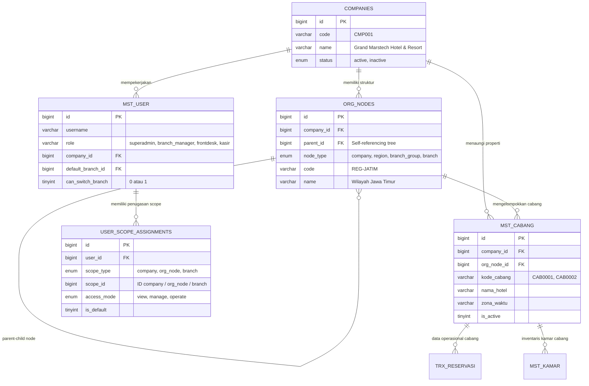
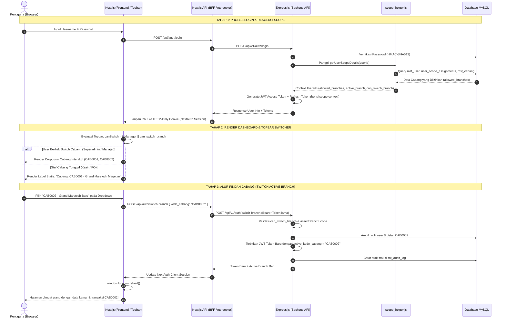

# Arsitektur & Alur Multi-Branch Enterprise Hierarchy
**Grand Marstech Hotel & Resort Enterprise PMS**

Dokumen ini membedah secara komprehensif struktur, logika, dan alur kerja (*end-to-end flow*) dari sistem **Multi-Branch Enterprise Hierarchy**, termasuk fungsi mendalam dari tabel `org_nodes` dan `user_scope_assignments`, serta bagaimana isolasi data dan perpindahan cabang (*branch switching*) bekerja dari lapisan database hingga UI.

---

## 1. Latar Belakang & Tujuan Arsitektur

Dalam industri perhotelan (*hospitality*), sebuah jaringan hotel dapat memiliki:
1. **Holding / Korporasi** (e.g. *PT Marstech Global / Grand Marstech Hotels*) yang memiliki puluhan hotel.
2. **Wilayah / Regional** (e.g. *Regional Jawa Timur*, *Regional Jawa Tengah*, *Regional Bali & Nusa Tenggara*).
3. **Unit Properti / Cabang Fisik** (e.g. *CAB0001 - Grand Marstech Magetan*, *CAB0002 - Grand Marstech Batu*).
4. **Hierarki Jabatan yang Beragam**:
   - **Superadmin / Corporate Executive**: Memerlukan visibilitas global ke seluruh cabang dan laporan konsolidasi.
   - **Regional Manager**: Bertanggung jawab atas seluruh hotel di satu provinsi/wilayah regional.
   - **General Manager (Cluster)**: Mengelola 2 atau 3 cabang spesifik dalam area berdekatan.
   - **Staf Operasional (Kasir, Resepsionis, Housekeeping)**: **Wajib terkunci** hanya pada 1 cabang tempat mereka bertugas, demi keamanan audit kas, inventaris kamar, dan kerahasiaan tamu.

Arsitektur ini dirancang untuk menjawab kebutuhan tersebut secara aman, fleksibel (*scalable*), dan idempoten.

---

## 2. Struktur Entitas & ERD (Entity Relationship Diagram)

Arsitektur ini menghubungkan 5 entitas utama:



---

## 3. Pembedahan Mendalam: Apa Fungsi `org_node`?

Tabel `org_nodes` merepresentasikan **pohon struktur organisasi hierarki (Organizational Tree)** yang bersifat rekursif (*self-referencing parent-child*).

### A. Mengapa Memerlukan `org_node`? (Problem of Scale)
Jika sebuah sistem hanya menghubungkan User langsung ke Cabang (tabel relasi user-cabang biasa), maka ketika sebuah grup hotel memiliki 50 cabang di Jawa Timur:
- Saat mengangkat seorang **Regional Manager Jawa Timur**, admin harus mencentang/menambahkan 50 baris relasi secara manual satu per satu.
- Ketika hotel ke-51 dibangun di Surabaya, admin harus mengedit seluruh akun manajer regional untuk menambahkan cabang ke-51.
- Hal ini rentan kesalahan manusia (*human error*) dan tidak efisien.

Dengan adanya `org_node`:
- Dibuat 1 node: `REG-JATIM` (*Wilayah Jawa Timur*).
- Seluruh 50 cabang dihubungkan ke `org_node_id = REG-JATIM`.
- Regional Manager cukup diberikan penugasan ke `scope_type = 'org_node'`, `scope_id = REG-JATIM`.
- Secara otomatis, berapapun cabang yang berada di bawah `REG-JATIM` langsung dapat diakses oleh Regional Manager tanpa perlu mengubah data hak akses user lagi!

### B. Atribut & Jenis Node (`node_type`)
| Kolom | Tipe | Deskripsi & Fungsi |
| :--- | :--- | :--- |
| `id` | `BIGINT UNSIGNED` | Primary key unik dari node hierarki. |
| `company_id` | `BIGINT UNSIGNED` | ID holding / perusahaan pemilik node. |
| `parent_id` | `BIGINT UNSIGNED NULL` | Pointer ke node atasan (misal: Sub-Region menginduk ke Region, Region menginduk ke Company). |
| `node_type` | `ENUM` | Level hierarki: <br>• `company` (Level korporat holding)<br>• `region` (Wilayah geografis, e.g. Jatim, Jabar)<br>• `branch_group` (Kluster khusus, e.g. City Hotels, Resort Hotels)<br>• `branch` (Node perwakilan tingkat unit) |
| `code` | `VARCHAR(50)` | Kode identitas node (e.g. `REG-JATIM`, `REG-JABAR`). |
| `name` | `VARCHAR(150)` | Nama deskriptif (e.g. *Wilayah Jawa Timur & Bali*). |

---

## 4. Pembedahan Mendalam: Apa Fungsi `user_scope_assignment`?

Tabel `user_scope_assignments` adalah **mesin otorisasi dinamis (*Authorization Matrix Bridge*)** yang menentukan *seberapa luas dan seberapa dalam* wewenang seorang pengguna di dalam organisasi.

### A. Konsep Abstraksi Scope Polymorphic
Tabel ini menggunakan pola *polymorphic reference* melalui pasangan kolom:
1. `scope_type`: Menyatakan level cakupan wewenang (`'company'`, `'org_node'`, atau `'branch'`).
2. `scope_id`: Menyatakan ID target dari level tersebut.

```
┌─────────────────────────────────────────────────────────────┐
│                   USER_SCOPE_ASSIGNMENT                     │
├──────────────┬────────────┬───────────┬─────────────────────┤
│ user_id      │ scope_type │ scope_id  │ Artinya             │
├──────────────┼────────────┼───────────┼─────────────────────┤
│ 1 (Bambang)  │ company    │ 1         │ Akses Seluruh Cabang│
│ 2 (Arya)     │ org_node   │ 1 (Jatim) │ Akses Cabang Jatim  │
│ 3 (Budi)     │ branch     │ 28 (Mgt)  │ Khusus Cabang Mgt   │
│ 4 (Giska)    │ branch     │ 29 (Batu) │ Khusus Cabang Batu  │
└──────────────┴────────────┴───────────┴─────────────────────┘
```

### B. Penjelasan Kolom-Kolom Kunci

1. **`scope_type` (Tingkat Cakupan)**:
   - `'company'`: Pengguna memiliki wewenang setingkat holding. Sistem akan memberikan akses ke **semua cabang** aktif yang dimiliki oleh `company_id` tersebut.
   - `'org_node'`: Pengguna memiliki wewenang pada satu cabang hierarki (region / kluster). Sistem akan mengeksekusi *subquery* mencari semua `mst_cabang` yang memiliki `org_node_id = scope_id`.
   - `'branch'`: Pengguna dibatasi secara spesifik pada 1 properti hotel fisik saja (`mst_cabang.id = scope_id`).

2. **`access_mode` (Modus Hak Akses)**:
   - `'view'`: Hanya boleh melihat laporan, analitik, dan data (e.g. Komisaris, Auditor Eksternal).
   - `'operate'`: Boleh melakukan transaksi harian operasional (e.g. Check-in, Kasir, Checkout, Room cleaning).
   - `'manage'`: Memiliki hak administratif (e.g. Mengubah harga kamar, setup diskon season, menambah staf, konfigurasi hotel).

3. **`is_default` (Penanda Cabang Awal)**:
   - Bernilai `1` untuk menandai cabang mana yang akan otomatis aktif saat pengguna pertama kali login.

---

## 5. Alur Kerja Lengkap (End-to-End Execution Flow)

Berikut adalah diagram interaksi lengkap dari saat User melakukan login hingga mengakses dan beralih cabang:



---

## 6. Cara Backend Melakukan Resolusi Scope (`scope_helper.js`)

File `express_pms_be/routes/v1/components/tools/scope_helper.js` bekerja dengan algoritma berikut:

```
[Mulai: getUserScopeDetails(userId)]
   │
   ├─► 1. Ambil data User dari `mst_user` (role, company_id, default_branch_id, can_switch_branch)
   │
   ├─► 2. Cek Role: Apakah 'superadmin', 'master', atau punya assignment scope_type = 'company'?
   │        │
   │        ├─► [YA]: Query seluruh cabang aktif di `mst_cabang`
   │        │        (allowedBranches = Semua cabang di perusahaan / sistem)
   │        │
   │        └─► [TIDAK]: Ambil assignments dari `user_scope_assignments`:
   │                 ├─ Jika scope_type = 'branch'   ──► Tambahkan branch_id ke Set
   │                 └─ Jika scope_type = 'org_node' ──► Query semua mst_cabang di bawah node tersebut
   │
   ├─► 3. Tentukan Active / Default Branch:
   │        Cocokkan `user.default_branch_id` dengan `allowedBranches`.
   │        Jika tidak cocok, gunakan `allowedBranches[0]` sebagai cabang aktif.
   │
   ├─► 4. Tentukan Hak Switch (`can_switch_branch`):
   │        Jika role adalah Superadmin/Admin/Manajer ATAU kolom can_switch_branch = 1,
   │        maka User memiliki hak berpindah cabang.
   │
   └─► 5. Return Context Object:
            {
              company_id,
              active_kode_cabang,
              active_branch_name,
              allowed_branches: [...],
              allowed_kode_cabang: ['CAB0001', 'CAB0002'],
              can_switch_branch: true/false
            }
```

---

## 7. Penegakan Isolasi Data (*Data Isolation Enforcement*)

Agar staf hotel cabang Magetan tidak sengaja melihat atau mengubah data reservasi hotel cabang Batu, sistem menerapkan proteksi bertingkat (*defense-in-depth*):

1. **Middleware Header Validation (`middleware/validate_header.js`)**:
   - Mengambil token JWT, memverifikasi tanda tangan kriptografis, dan menyuntikkan `req.auth` ke setiap request.
   - Jika client mengirimkan header `X-Branch-Code`, middleware memastikan kode cabang tersebut terdaftar di dalam array `req.auth.allowed_kode_cabang`. Jika tidak, request langsung ditolak dengan **HTTP 403 Forbidden**.

2. **Fungsi `assertBranchScope(req, targetBranch)`**:
   - Digunakan sebelum melakukan transaksi (e.g. Check-in, Reservasi, Pembuatan Kamar).
   - Memastikan bahwa target cabang yang dikirimkan dalam body request memang berada di dalam wewenang pengguna.

3. **Fungsi `applyBranchFilter(query, req, column)`**:
   - Pada endpoint data tabel (e.g. daftar kamar, tamu menginap, shift kasir), helper ini otomatis menyematkan klausa `.where("kode_cabang", activeBranch)` pada query Knex, sehingga database MySQL hanya mengembalikan baris yang relevan dengan cabang aktif pengguna.

---

## 8. Matriks Hak Akses Berdasarkan Role

| Role Pengguna | Scope Default | Jumlah Cabang yang Diakses | Bisakah Berpindah Cabang? | Bentuk Tampilan Topbar |
| :--- | :--- | :--- | :---: | :--- |
| **Superadmin / Master** | `company` (Semua) | Seluruh Cabang di Database | **YA** | Dropdown Interaktif |
| **Corporate Manager** | `company` | Seluruh Cabang Perusahaan | **YA** | Dropdown Interaktif |
| **Regional Manager** | `org_node` (e.g. Jatim) | Seluruh Cabang di Region | **YA** | Dropdown Interaktif |
| **Branch Manager (GM)** | `branch` (1 atau lebih) | Cabang yang ditugaskan | **YA** (jika > 1 cabang) | Dropdown Interaktif |
| **Frontdesk / Receptionist** | `branch` (1 cabang) | 1 Cabang Spesifik | **TIDAK** | Badge Statis Teks |
| **Kasir** | `branch` (1 cabang) | 1 Cabang Spesifik | **TIDAK** | Badge Statis Teks |
| **Housekeeping** | `branch` (1 cabang) | 1 Cabang Spesifik | **TIDAK** | Badge Statis Teks |

---

## 9. Kesimpulan & Manfaat Arsitektur Ini

1. **Keamanan Maksimal**: Staf garis depan (*front-line staff*) terisolasi secara ketat pada unit kerjanya masing-masing, mencegah kebocoran data antar properti hotel.
2. **Kenyamanan Eksekutif**: Pimpinan hotel, manajer area, dan superadmin dapat memantau dan berpindah cabang kapan saja hanya dengan 1 klik pada Topbar tanpa harus logout atau mengingat banyak akun.
3. **Mudah Berkembang (*Scalable*)**: Menambah 10 hotel baru cukup dengan menambahkan baris di `mst_cabang` dan mengaitkannya ke `org_nodes`, seluruh manajer regional dan corporate langsung otomatis memiliki akses.
