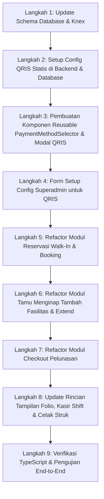

# Rencana Implementasi: Pembaruan Metode Pembayaran Hotel & Integrasi Folio

**Tanggal:** 29 September 2026  
**Status:** Menunggu Persetujuan  
**Tujuan:** Merombak opsi metode pembayaran di seluruh sistem PMS Hotel dengan standar perbankan & best practice modern:
1. **Kartu (Debit / Kredit)**: Memilih jenis kartu (Debit / Kredit) dan Bank penerbit (BCA, Mandiri, BNI, BRI, dsb).
2. **QRIS Statis (Demo & Konfigurabel)**: Menampilkan QRIS Statis yang dapat diatur/diubah gambarnya dan identitas merchant-nya oleh Superadmin melalui menu Pengaturan (*Setup Config*).
3. **Transfer Bank / Virtual Account (VA)**: Memilih Bank tujuan (BCA, Mandiri, BNI, BRI, BSI, Permata, dsb) beserta informasi nomor rekening/VA hotel.
4. **Penghapusan Opsi Mesin EDC**: Mesin EDC dihapus sebagai opsi terpisah karena pada dasarnya EDC adalah perangkat pemroses pembayaran Kartu.
5. **Konsistensi Rincian di Semua Folio & Transaksi**: Seluruh data metode pembayaran, rincian bank, kartu, dan nomor referensi tersimpan rapi dan tampil di Rincian Aktivitas Kasir (Shift), Tamu Menginap, Checkout, Reservasi, serta Struk Thermal/Faktur.

---

## 1. Analisis Kebutuhan & Struktur Data

### 1.1. Status Saat Ini vs Kebutuhan Baru
| Aspek | Kondisi Saat Ini | Standar Baru (Best Practice) |
|---|---|---|
| **Opsi Pembayaran** | `cash`, `card`, `transfer`, `edc` (bervariasi di tiap dialog) | Terstandarisasi: `cash`, `card`, `qris`, `transfer` |
| **Mesin EDC** | Opsi terpisah (`edc`) | **Dihapus**; disatukan ke dalam `card` |
| **Pembayaran Kartu** | Hanya teks input bebas atau dropdown mentah | Memilih **Jenis Kartu** (*Debit* / *Kredit*) + **Dropdown Bank Penerbit** + No. Kartu / Trace Approval |
| **QRIS** | Tidak ada atau bercampur dengan EDC | **QRIS Statis** khusus dengan modal preview QR Code interaktif, info merchant & NMID, serta dapat diubah oleh Superadmin |
| **Transfer Bank / VA** | Input bebas tanpa panduan | **Dropdown Bank VA Hotel** + Nomor Rekening Resmi + No. Referensi Transfer |
| **Rincian Folio** | Hanya menampilkan string `payment_method` mentah | Menampilkan rincian terformat: Badge Metode, Logo/Nama Bank, Jenis Kartu, dan No. Referensi |

### 1.2. Struktur Database
- **Tabel `trx_payment`**:
  - Kolom `payment_method`: Perluasan ENUM dari `('cash','card','transfer','edc','deposit','voucher')` menjadi mendukung `'qris'` secara resmi: `enum('cash','card','transfer','qris','edc','deposit','voucher')`.
  - Penambahan Kolom Baru:
    - `bank_name` `VARCHAR(50) NULL`: Nama bank (misal: `BCA`, `Mandiri`, `BNI`, `BRI`, `CIMB Niaga`, `Permata`, `BSI`).
    - `card_type` `VARCHAR(20) NULL`: Jenis kartu (misal: `debit`, `credit`).
  - Kolom `reference_no` `VARCHAR(255) NULL`: Tetap diisi dengan format deskriptif standar (contoh: `[BCA - DEBIT] No: 4111**** / Trace: 849201`) sebagai fallback kompatibilitas penuh untuk query lama dan cetak nota.

- **Tabel `config` (Pengaturan Superadmin)**:
  - `msQrisImage`: URL gambar atau Base64 file QRIS Statis Hotel.
  - `msQrisMerchantName`: Nama Merchant QRIS (default: `Grand Marstech Hotel`).
  - `msQrisNmid`: Nomor Identitas Merchant Nasional (NMID) (default: `ID1020039485721`).
  - `msBankAccounts`: JSON string data rekening bank hotel (BCA, Mandiri, BNI, BRI, BSI, Permata).

---

## 2. Rencana Arsitektur & Komponen

### 2.1. Backend Updates (`express_pms_be`)
1. **Database Migration / Schema Update**:
   - Menjalankan migrasi Knex / skrip alter table untuk memperluas ENUM `payment_method` di `trx_payment` agar mendukung `'qris'`.
   - Menambahkan kolom `bank_name` dan `card_type` ke tabel `trx_payment`.
2. **Seed Default Config QRIS**:
   - Memastikan key `msQrisImage`, `msQrisMerchantName`, `msQrisNmid`, dan data rekening bank tersimpan di tabel `config`.
3. **Endpoint Transaksi**:
   - `walk_in_submit.js` (Walk-In): Menyimpan `bank_name` & `card_type` jika ada.
   - `reservation_create.js` (Booking): Menyimpan `bank_name` & `card_type`.
   - `fasilitas_add.js` (Layanan In-Stay): Menyimpan `bank_name` & `card_type`.
   - `extend_submit.js` (Perpanjang Kamar): Menyimpan `bank_name` & `card_type`.
   - `checkout_submit.js` (Pelunasan Checkout): Menyimpan `bank_name` & `card_type`.
4. **Endpoint Reporting & Billing**:
   - `shift_detail.js` & `shift_current.js`: Mengikutsertakan `bank_name` dan `card_type` dalam query data pembayaran.
   - `billing_helper.js` & `invoice-detail`: Menyediakan rincian lengkap pembayaran ke faktur dan folio.

### 2.2. Frontend: Reusable Component `PaymentMethodSelector`
Dibuat komponen modular: `app/components/payment/PaymentMethodSelector.tsx`:
- **Pilihan Metode Modern (Pills / Radio Tabs)**:
  1. 💵 **Tunai (Cash)**: Input nominal diterima & kalkulasi kembalian.
  2. 💳 **Kartu (Debit / Kredit)**:
     - Tombol pilihan: *Debit* vs *Kredit*.
     - Dropdown Bank Penerbit: BCA, Mandiri, BNI, BRI, CIMB Niaga, Permata, Danamon, BSI, Lainnya.
     - Input No. Kartu / Trace Approval.
  3. 📱 **QRIS Statis (Demo)**:
     - Menampilkan info QRIS & tombol interaktif **"Tampilkan QR Code"** (membuka modal QR Code statis siap di-scan).
     - Menampilkan nama merchant dan NMID.
     - Input No. Referensi / RRN transaksi.
  4. 🏦 **Transfer Bank / Virtual Account (VA)**:
     - Dropdown Bank Tujuan: BCA, Mandiri, BNI, BRI, Permata, BSI.
     - Menampilkan kotak info rekening hotel (Nama Bank, No. Rekening / No. VA, Atas Nama, tombol Salin).
     - Input Bukti Transfer / No. Referensi Transaksi.
- **Modal QRIS Statis Terintegrasi**:
  - Modal pop-up elegan menampilkan kode QRIS statis dengan logo QRIS resmi, nama merchant, dan instruksi scan e-wallet (GoPay, OVO, Dana, BCA Mobile, Livin', dsb).

### 2.3. Halaman Superadmin: Pengaturan QRIS (`setup/config`)
- Memperbarui `app/(main)/setup/config/components/display/form.tsx` & `page.tsx`:
  - Menambahkan section baru: **"Pengaturan Pembayaran & QRIS Statis Hotel"**.
  - Fitur upload gambar QRIS statis atau preview QRIS saat ini.
  - Form input Nama Merchant dan NMID QRIS.
  - Superadmin dapat mengubah data ini kapan saja, dan langsung berlaku di seluruh kasir.

### 2.4. Integrasi ke Halaman & Modul Transaksi
1. **Reservasi Baru / Walk-In**:
   - `dialog_konfirmasi_walkin.tsx`: Menggunakan `PaymentMethodSelector`, menghapus opsi EDC.
   - `step_payment.tsx`: Menghapus opsi EDC, mengintegrasikan detail kartu/bank/QRIS.
2. **Reservasi Booking**:
   - `reservasi_booking/components/step_payment.tsx` & `step_confirmation.tsx`: Memperbarui opsi pembayaran dan menghapus EDC.
3. **Tamu Menginap (Inhouse)**:
   - `dialog_tambah_fasilitas.tsx`: Menghapus dropdown lama (`edc`, `debit_card`, `credit_card`), mengganti dengan `PaymentMethodSelector`.
   - `dialog_extend_stay.tsx`: Menghapus dropdown lama, mengganti dengan `PaymentMethodSelector`.
   - `dialog_folio_detail.tsx`: Mempercantik tabel pembayaran folio:
     - Badge metode yang informatif (warna dan ikon sesuai metode).
     - Rincian Bank & Tipe Kartu di samping no. referensi.
4. **Checkout**:
   - `checkout/page.tsx`: Memperbarui formulir pelunasan kasir dengan `PaymentMethodSelector`.
5. **Kasir Shift**:
   - `kasir_shift/page.tsx`: Menampilkan rincian metode (`KARTU DEBIT BCA`, `QRIS STATIS`, `TRANSFER VA MANDIRI`) di tabel transaksi kasir aktif.
   - `kasir_shift/components/dialog_shift_detail.tsx`: Menampilkan rincian metode yang informatif di riwayat shift dan cetak rekapan shift.
6. **Cetak Nota & Invoice**:
   - `CetakInvoiceThermal.tsx` (Struk 80mm): Menampilkan metode, bank, dan nomor referensi secara terstruktur.
   - `cetakInvoiceHotel.tsx` (Faktur A4): Menampilkan tabel rincian pembayaran dengan kolom metode, bank/rekening, dan no. referensi.

---

## 3. Rencana Eksekusi Langkah-demi-Langkah

### Rincian Langkah:
1. **Langkah 1 (Database & Backend)**:
   - Eksekusi script SQL / Knex alter table untuk menambahkan `'qris'` ke enum `trx_payment.payment_method` dan menambahkan kolom `bank_name` & `card_type`.
   - Perbarui handler backend (`walk_in_submit`, `checkout_submit`, `fasilitas_add`, `extend_submit`, `reservation_create`, `shift_detail`).
2. **Langkah 2 (Config QRIS Default)**:
   - Pastikan konfigurasi QRIS default masuk ke database jika belum ada.
   - Sediakan API get config untuk frontend.
3. **Langkah 3 (Frontend Reusable Component)**:
   - Bangun `PaymentMethodSelector.tsx` dengan dukungan penuh untuk Kartu (Debit/Kredit + Bank), QRIS Statis (dengan modal preview), Transfer Bank/VA (dengan nomor rekening resmi), dan Tunai.
4. **Langkah 4 (Menu Pengaturan Superadmin)**:
   - Tambahkan form konfigurasi QRIS di halaman `setup/config`.
5. **Langkah 5 (Walk-In & Booking)**:
   - Integrasikan `PaymentMethodSelector` ke `dialog_konfirmasi_walkin.tsx` dan `step_payment.tsx`.
6. **Langkah 6 (Tamu Menginap)**:
   - Pasang di `dialog_tambah_fasilitas.tsx` dan `dialog_extend_stay.tsx`.
   - Update tabel pembayaran di `dialog_folio_detail.tsx`.
7. **Langkah 7 (Checkout)**:
   - Pasang di `checkout/page.tsx` pada form pelunasan tagihan.
8. **Langkah 8 (Kasir Shift & Print Invoice)**:
   - Perbarui tabel aktivitas kasir di `kasir_shift/page.tsx` dan `dialog_shift_detail.tsx`.
   - Perbarui rendering pembayaran di `CetakInvoiceThermal.tsx` dan `cetakInvoiceHotel.tsx`.
9. **Langkah 9 (Pengujian & Validasi)**:
   - Jalankan `npx tsc --noEmit` untuk memastikan tidak ada kesalahan tipe TypeScript.
   - Lakukan pengujian langsung di browser.

---

## 4. Hasil yang Diharapkan
1. Opsi mesin EDC sepenuhnya bersih dari aplikasi dan digantikan oleh pembayaran Kartu dengan informasi detail (Debit/Kredit + Bank).
2. QRIS statis memiliki modal tampilan scan yang profesional dan dapat disesuaikan gambarnya oleh Superadmin.
3. Transfer bank memiliki panduan nomor rekening/VA yang jelas bagi tamu dan kasir.
4. Di seluruh rincian transaksi (Kasir Shift, Tamu Menginap, Checkout, Nota Cetak), riwayat transaksi menampilkan metode pembayaran lengkap beserta detail bank, kartu, dan nomor referensinya secara rapi dan konsisten.
